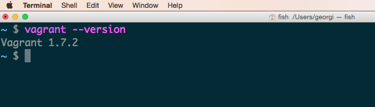
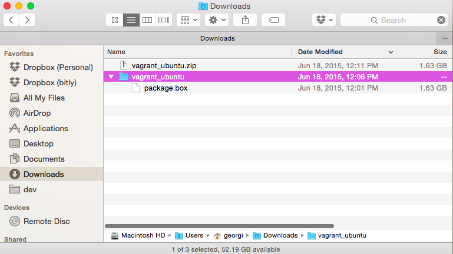
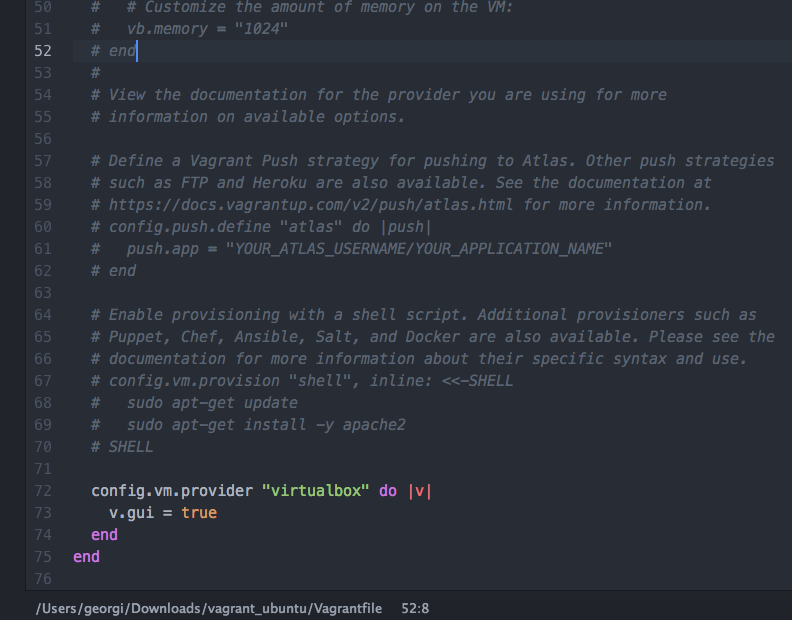
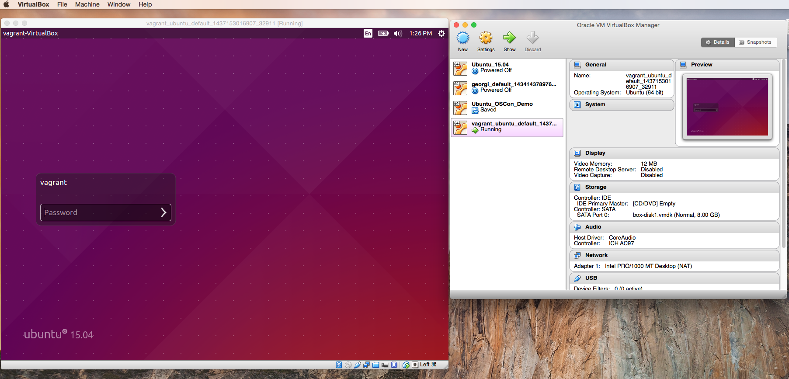
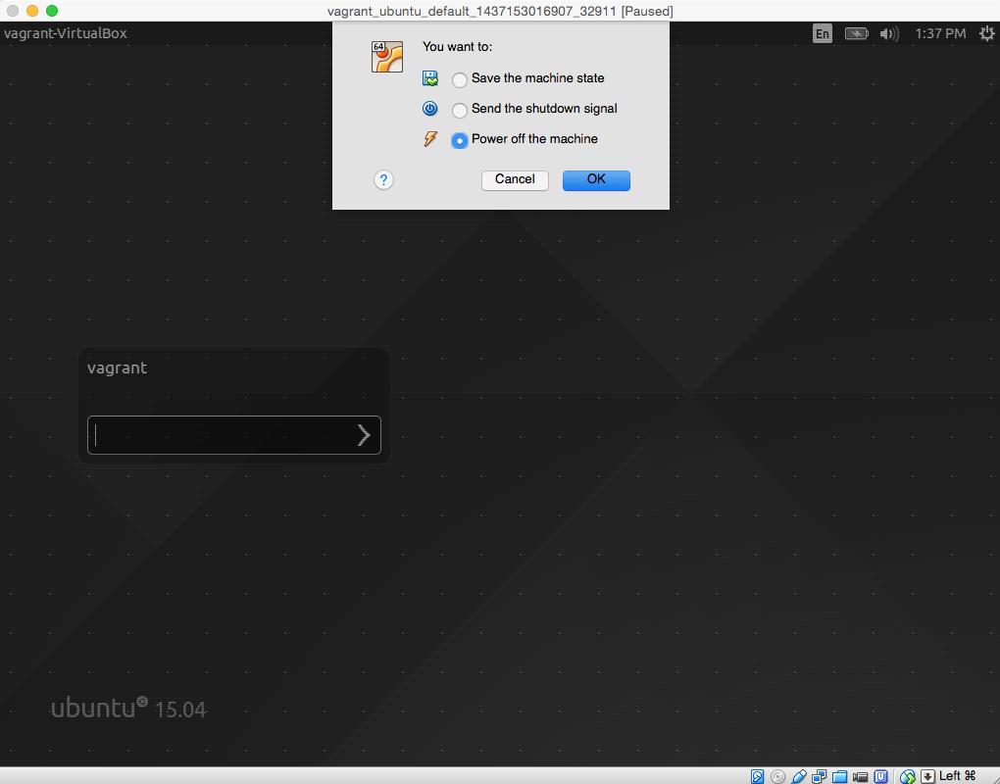
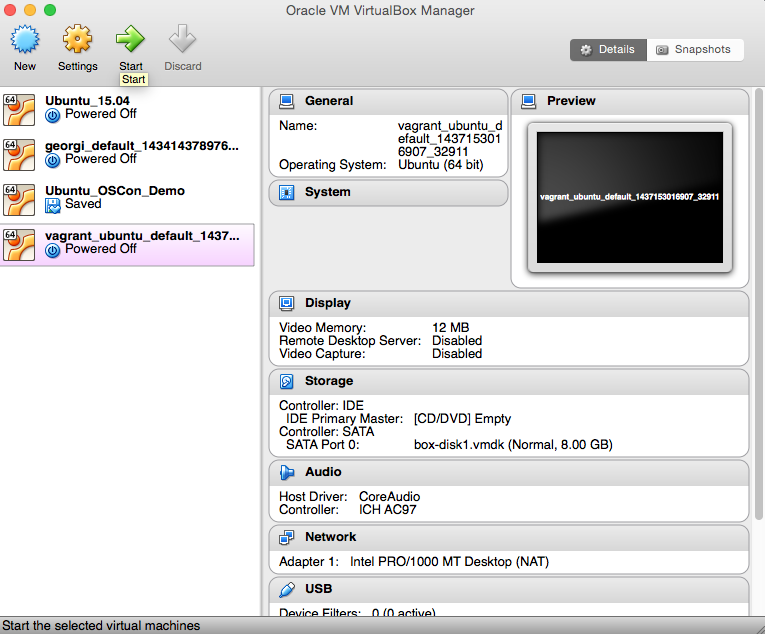

# Linux Bootcamp: From Casual Linux User to Kernel Hacker (Workshop)

Session Info:
[OSCON:Linux Bootcamp: From Casual Linux User to Kernel Hacker](http://www.oscon.com/open-source-2015/public/schedule/detail/41300)

Monday, July 20th 2015 at 9:00am to 12:30pm

## How to use these materials
This GitHub repo contains an Ubuntu installation guide as well as all the workshop exercises.

All workshop exercises can be found [here](workshop).
All instructions below are for mac but they should be easily translatable to windows machines.

## Ubuntu Setup
For this workshop, we will use a program called Vagrant to run a full copy of Ubuntu Desktop version 15.04 (the latest and greatest). Vagrant requires that VirtualBox be pre-installed and is a handy tool which allows users to load pre-installed software. If we didn't use Vagrant we'd have to spend a good chunk of the class just installing Ubuntu on VirutalBox which is pretty boring :)

## Prerequsites
1. Free up around 10GB's on your laptop to get started.
2. It's important that you download the 3 files from the OSCON servers so as not to overload the conference wi-fi connection. 
3. Please go to http://10.10.32.101 to download the following:
1. **Download and install** VirtualBox 4.3.26 for your OS
1. **Download and install** Vagrant for your OS
1. **Download** the Ubuntu_15.04 vagrant image that we have already pre-built

## Setting up Ubuntu with Vagrant

#### Check Vagrant is installed
Open up the Terminal program from Finder > Applications > Utilities > Terminal.
Check that you have Vagrant installed successfully by typing `vagrant --version` in your Terminal and hitting enter. You should see something like `Vagrant 1.7.2`.


#### Download the Ubuntu vagrant image
You should have previously downloaded a zipped folder called `vagrant_ubuntu` from Dropbox ([download link](https://www.dropbox.com/s/u0y6jq3iz2fjhfu/vagrant_ubuntu.zip?dl=0)).
Unzip it, this will create a folder called `vagrant_ubuntu`. Inside the folder `vagrant_ubuntu`, and you should see a file called package.box.


#### Install the Ubuntu box in Vagrant
From your Terminal, change into the `vagrant_ubuntu` directory.

```bash
$ cd ~/Downloads/vagrant_ubuntu/ (This might be a different location for you)           # cd = change directory
$ ls
package.box
$ vagrant box add {boxname} package.box
```
in our case:
```bash
$ vagrant box add Ubuntu-Desktop-15.04 package.box
```
This installed an Ubuntu box called `Ubuntu-Desktop-15.04` with Vagrant.

#### Init the Vagrant box
```
$ vagrant init {boxname}
```
in our case:
```
$ vagrant init Ubuntu-Desktop-15.04
```
If you list the contents of this directory (`ls`), you'll now see a new file that was created `Vagrantfile`.

```bash
$ ls -la
total 3174080
drwxr-xr-x@ 4 georgi  staff         136 Jul  7 20:59 .
drwx------+ 6 georgi  staff         204 Jul  7 20:47 ..
-rw-r--r--  1 georgi  staff        3032 Jul  7 20:59 Vagrantfile
-rw-r--r--@ 1 georgi  staff  1625121290 Jun 18 12:01 package.box
```

#### Enable GUI
We now need to enable the GUI (Graphical User Interface). To do this edit the generated `Vagrantfile` with any text editor (Sublime, vi, Atom, TextEdit) by adding the following lines to the end of the file before the final line which says `end`.

```bash
config.vm.provider "virtualbox" do |v|
  v.gui = true
end
```
Your file should now look like this:



Alternativly, you can replace the `Vagrantfile` created with the one [here](https://raw.githubusercontent.com/GeorgiCodes/linux_bootcamp/master/downloads/vagrant_ubuntu_image/Vagrantfile).

#### Spin it up!
We now have one final step to finish all the necessary initialization steps to setup Ubuntu with Vagrant.

Firstly open up the VirtualBox program from your Finder in Applications > VirtualBox. We'll come back to this program in a second.

Next, we run our final command:
```bash
$ vagrant up
Bringing machine 'default' up with 'virtualbox' provider...
==> default: Importing base box 'Ubuntu-Desktop-15.04'...
==> default: Matching MAC address for NAT networking...
==> default: Setting the name of the VM: vagrant_ubuntu_default_1437153016907_32911
==> default: Clearing any previously set network interfaces...
==> default: Preparing network interfaces based on configuration...
    default: Adapter 1: nat
==> default: Forwarding ports...
    default: 22 => 2222 (adapter 1)
==> default: Booting VM...
==> default: Waiting for machine to boot. This may take a few minutes...
    default: SSH address: 127.0.0.1:2222
    default: SSH username: vagrant
    default: SSH auth method: private key
    default: Warning: Connection timeout. Retrying...
    default:
    default: Vagrant insecure key detected. Vagrant will automatically replace
    default: this with a newly generated keypair for better security.
    default:
    default: Inserting generated public key within guest...
    default: Removing insecure key from the guest if its present...
    default: Key inserted! Disconnecting and reconnecting using new SSH key...
==> default: Machine booted and ready!
==> default: Checking for guest additions in VM...
==> default: Mounting shared folders...
    default: /vagrant => /Users/georgi/Downloads/vagrant_ubuntu
The following SSH command responded with a non-zero exit status.
Vagrant assumes that this means the command failed!

/sbin/initctl emit --no-wait vagrant-mounted MOUNTPOINT=/vagrant

Stdout from the command:


Stderr from the command:

stdin: is not a tty
initctl: Unable to connect to Upstart: Failed to connect to socket /com/ubuntu/upstart: Connection refused
```
Don't worry about those connection refused errors.

Vagrant has now done its job and we will only use VirtualBox from now on.

Open up VirutalBox and you will see and Ubuntu image called something like "vagrant_ubuntu_image_xxxxxx" listed on the left. Under the image name you will see the words "running" - this means that your Ubuntu image is up and running.



**The username and password for this Ubuntu image are both `vagrant`.**

#### Starting up and shutting down your Ubuntu image
You can shut it down at any time by pressing the red x on the Ubuntu window.


You can start it up by selecing the image name on the left and pressing the green Start button inside VirtualBox

