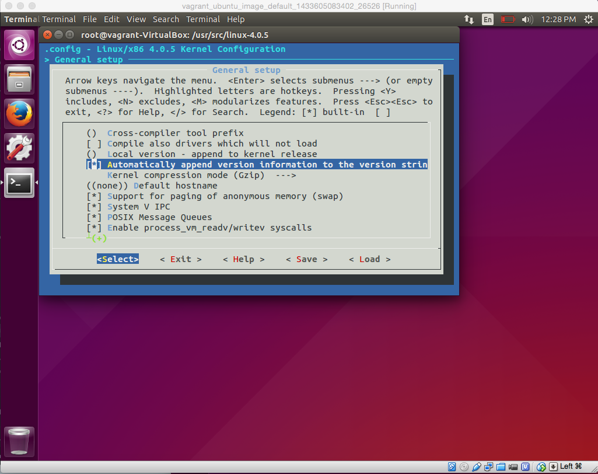

# Kernel

## How to configure and build your own kernel

#### 1. EXERCISE: What version of the kernel are you running?
Parts of this have been copied from The Linux Information Project website for the purpose of this tutorial. http://www.linfo.org/find_kernel_version.html

It can be useful to know the version number of the kernel (i.e., the core of the operating system) on a particular Linux system. Not only is it instructive in itself, but it can also be helpful in diagnosing and upgrading systems because each release of the kernel contains some differences, sometimes minor and sometimes substantial.

Fortunately, it is extremely easy to obtain this information, and, in fact, there is a choice of at least five ways to do it. Moreover, each of these techniques can also be used, with slight modification, to obtain additional information about a system.

Perhaps the easiest is to use the uname command (which reports basic information about a system's hardware and software) with its -r option, that is,

`uname -r`

This method has the advantages that only a minimal amount of typing is required and that it provides just information about the kernel with no extra output to search through.

A second way is to look at the `/proc/version` file. This can be easily accomplished by using the cat command (which is commonly used to read and concatenate files), i.e.,

`cat /proc/version`

#### 2. EXERCISE: Fetch kernel source and create a kernel config file

##### Setup
1. Open up a terminal (side bar blackbox icon).
1. Switch to superuser `sudo -i`. This command switches your current terminal to be logged in as a superuser.
1. `cd /usr/src`. Kernel source is always stored in this directory.

##### Fetch the latest stable kernel source
Ordinarily you would probably want to fetch your kernel sour from kernel.org but given conference wifi is often extremely slow, we've downloaded version 4.0.5 and included it in your vagrant image. You can find it in the home directory so you can just simply copy it across.
```bash
# make sure you are in /usr/src then copy over the tarball
cp /home/vagrant/handy_workshop_files/linux-4.0.5.tar.xz .
# Unpack the tarball: this will uncompress the file and create a new directory linux-4.0.5
$ tar -xvf linux-4.0.5.tar.xz
# list contents
$ ls
linux-4.0.5               vboxguest-4.3.28
linux-4.0.5.tar.xz       linux-headers-3.19.0-18
linux-headers-3.19.0-18-generic
```

##### Customizing the kernel
We are now going to customize our kernel by toggling on two options as explained below.

* Change into kernel folder `cd linux-4.0.5`
* Firstly install `sudo apt-get install libncurses5-dev` as this is needed for the GUI to work.
* Run `make menuconfig`
* Select `General Setup` from the list and turn on 'Automatically append version information...'.

* Select `Device Drivers` from the main menu. Scroll right down to the bottom and select `Thunderbolt support for Apple Devices`. Now we will turn this on as a `built-in` kernel option not a `module` option. To do this, hit space bar until an `M` appears. Please do this even if you are not on a Mac - this is merely a learning exercise :)
* Spend some time poking around and looking at all the different options. Its dizzying how many there are, setting each on individually would take you all day!
* Save and exit.
* Confirm that a file called `.config` was created
* Take a look at the contents of the file by using the `cat` command. By setting 'Automatically append version information...' in the GUI we have set `CONFIG_LOCALVERSION_AUTO=y`. (Setting to be explained in next exercise)
```bash
$ cat .config | grep CONFIG_LOCALVERSION_AUTO
CONFIG_LOCALVERSION_AUTO=y
```

#### 3. EXERCISE: Customizing your kernel release string
It's always fun to personalize things. The `CONFIG_LOCALVERSION_AUTO=y` config option we set previously allows us to append a version name to our kernel version string.

* The version of the currently running kernel can be found by running:
```bash
$ uname -r
4.0.5-040005-generic
```
* Update the `EXTRAVERSION` field in the `Makefile` found in the root of the kernel source tree. Adding your name here or something silly like `-rainbow-unicorns-rule`. This will be appended to your kernel version name string. Note, start this with a dash `-`.
```bash
$ vi Makefile
PATCHLEVEL = 0
SUBLEVEL = 5
EXTRAVERSION = -rainbow-unicorns-rule
NAME = Hurr durr Ima sheep

# *DOCUMENTATION*
........
```
Whilst you are looking in the `Makefile`, take a look at the `NAME` field, what does it say? Kinda silly right - this is the name the Linux community voted on for this version of the Linux kernel :)
* Now to find out what the final kernel release string will be if you build this kernel run:
```bash
$ make kernelrelease
4.0.5-rainbow-unicorns-rule
```

#### 3B. EXERCISE: Building your kernel - TO DO AT HOME!!
There are multiple ways that you can build and install your own kernel, here I have presented one way. This will install the new (compressed) kernel image into the `/boot` directory so that GRUB can find it at boot time.

We will not do this in this workshop as building a kernel can take hours depending on how much grunt your laptop has!

1. Run the following commands and wait for victory!
```bash
make 	# builds a kernel ready to be installed
make modules_install: # Installs all of the newly-built modules. They will now show up under a directory in `/lib/modules`
make install 	#  Install the new (compressed) kernel image into the `/boot` directory so that GRUB can find it at boot time. And it also create a new initrd initial ram disk that goes along with that kernel to support the early part of the boot process
```

#### 4. EXERCISE: Install a pre-built kernel
As it will take too long build a kernel in this workshop, we've done this step for you, so for this exercise we will install it.

##### Install the kernel
```bash
# there are 3 files required to install a mainline kernel version, we've downloaded them already here
$ cd /home/vagrant/handy_workshop_files/mainline_kernel_4.0.5_debs/
# install the new kernel
$ sudo dpkg -i *.deb
```

##### Confirm it worked
* Take a look at `/boot` and confirm that there is a new vmlinuz, initrd image file and config file corresponding to your build version.
```bash
$ ls /boot
abi-3.19.0-18-generic            memtest86+.bin
abi-4.0.5-040005-generic         memtest86+.elf
config-3.19.0-18-generic         memtest86+_multiboot.bin
config-4.0.5-040005-generic      System.map-3.19.0-18-generic
grub                             System.map-4.0.5-040005-generic
initrd.img-3.19.0-18-generic     vmlinuz-3.19.0-18-generic
initrd.img-4.0.5-040005-generic  vmlinuz-4.0.5-040005-generic
```
* Check also that the `/lib/modules/$KERNEL_VERSION` directory has your new modules.
```bash
$ ls /lib/modules/$KERNEL_VERSION
3.19.0-15-generic  3.19.0-18-generic  4.0.5-040005-generic
```

#### 5. EXERCISE: Boot into your new kernel
Now your new kernel is built, let's boot into it! Your boot manager GRUB2 will automatically choose the latest kernel version to boot into.

##### Edit grub config to make the menu appear at boot
The GRUB2 menu doesn't appear automatically on Ubuntu. To make it appear we need to edit the grub config value. To do this:
```bash
# Open the grub config value. You will need to be in super user mode to edit and save this file hence the sudo
sudo vi /etc/default/grub
# change this from 0 to 5 and save the file
GRUB_HIDDEN_TIMEOUT=5
# this command is essential to apply the changes you made to the config file
update-grub
```

##### Boot into GRUB menu and select kernel version
* Type `reboot` from the terminal
* When your system starts up hold down the `SHIFT` key until a black screen with the GRUB menu appears. Select `Advanced Options for Debian GNU/Linux`
* You will be presented with a list of kernel versions. The latest kernel version (the one you just installed) should be already selected, if its not then select it.
* Once booted check for your custom kernel release string with `uname -r`.
```bash
$ uname -r
4.0.5-040005-generic
```

## /proc filesystem

#### 6. EXERCISE: A tour of /proc
* list the contents of the proc directory
```bash
$ cd /proc
$ ls
1     1126  1248  1436  22   48   594  917          filesystems  pagetypeinfo
10    1127  1250  1439  226  489  596  986          fs           partitions
1003  1129  1257  1444  23   49   597  987          interrupts   sched_debug
1005  1132  126   1451  231  5    6    990          iomem        schedstat
1010  1137  127   1453  24   50   606  991          ioports      scsi
1012  1140  128   1492  247  51   607  995          irq          self
1025  1147  1283  15    25   536  636  997          kallsyms     slabinfo
1030  1156  1295  1501  26   539  645  acpi         kcore        softirqs
1031  1161  1297  1530  27   545  660  asound       keys         stat
1038  1177  13    1539  28   547  665  buddyinfo    key-users    swaps
1050  1195  1321  1540  29   548  685  bus          kmsg         sys
1065  12    1339  1550  3    549  688  cgroups      kpagecount   sysrq-trigger
1073  1217  1345  16    30   55   7    cmdline      kpageflags   sysvipc
1083  122   1357  17    31   551  75   consoles     loadavg      thread-self
1089  1228  1359  178   314  559  76   cpuinfo      locks        timer_list
11    123   1365  18    350  56   77   crypto       mdstat       timer_stats
1103  1230  137   181   4    567  794  devices      meminfo      tty
1104  1232  1374  183   43   570  8    diskstats    misc         uptime
1105  1236  138   19    44   575  9    dma          modules      version
1110  1237  14    2     45   581  910  driver       mounts       vmallocinfo
1112  124   1424  20    46   585  914  execdomains  mtrr         vmstat
1118  1240  1426  21    47   589  915  fb           net          zoneinfo
```
Each of the numbered directories represents a process in the system. Because the first process created in GNU/Linux is the init process, it has a `process-id` of `1`.
* Perform an `ls` on the `1` directory to show a list of files associated with that process.
```bash
$ ls 1
attr             cpuset   limits      net            projid_map  stat
autogroup        cwd      loginuid    ns             root        statm
auxv             environ  map_files   numa_maps      sched       status
cgroup           exe      maps        oom_adj        schedstat   syscall
clear_refs       fd       mem         oom_score      sessionid   task
cmdline          fdinfo   mountinfo   oom_score_adj  setgroups   timers
comm             gid_map  mounts      pagemap        smaps       uid_map
coredump_filter  io       mountstats  personality    stack       wchan
```
* Some files in proc provide useful information on the currently running kernel. For example, to see info on our CPU, simply `cat` the `cpuinfo` file.
```bash
$ cat cpuinfo
processor	: 0
vendor_id	: GenuineIntel
cpu family	: 6
model		: 69
model name	: Intel(R) Core(TM) i7-4650U CPU @ 1.70GHz
stepping	: 1
microcode	: 0x19
cpu MHz		: 2304.932
cache size	: 6144 KB
physical id	: 0
siblings	: 1
core id		: 0
cpu cores	: 1
apicid		: 0
initial apicid	: 0
fpu		: yes
fpu_exception	: yes
cpuid level	: 5
wp		: yes
flags		: fpu vme de pse tsc msr pae mce cx8 apic sep mtrr pge mca cmov pat pse36 clflush mmx fxsr sse sse2 syscall nx rdtscp lm constant_tsc rep_good nopl pni monitor ssse3 lahf_lm
bugs		:
bogomips	: 4609.86
clflush size	: 64
cache_alignment	: 64
address sizes	: 39 bits physical, 48 bits virtual
power management:
```
* There are many useful files in /proc. To use them you just simply `cat` them. Try that out for the following: `cpuinfo`, `meminfo`, `filesystems`, `modules`, `mounts`.

#### 7. EXERCISE: Dynamically update the running kernel with /proc
* Run `cat /proc/sys/kernel/hostname` to see what the hostname is currently set too.
* Write to the same file and update the hostname to be "Linux-or-death" or something else of your choice.
```bash
# you'll notice the hostname is "vagrant-VirtualBox"
$ hostname
vagrant-VirtualBox
$ cat /proc/sys/kernel/hostname
vagrant-VirtualBox
# let's change it by echoing a string into the hostname file on the proc filesystem
$ echo "linux-or-death" > /proc/sys/kernel/hostname
$ cat /proc/sys/kernel/hostname
linux-or-death
$ hostname
linux-or-death
```

## Loadable Kernel Modules

**Helpful module Commands**
```bash
lsmod	# lists currently loaded modules
modinfo	# info about module

# loading/unloading
modprobe my_module	# loads module and its dependencies
modprobe -r my_module	# unloads module at its dependencies
OR
insmod my_module.ko # loads just the module (no dependencies)
rmmod my_module.ko # unloads just the module

# view kernel messages with either of:
/var/log/messages
dmesg | tail

uname -r 	# displays currently running kernel version
/lib/modules/`uname -r`/	# where module files are stored
```

#### 8. EXERCISE: Learn about `lsmod`

* Find out what file `lsmod` reads from. To do this let's refer to the handy `man` pages.
```bash
$ man lsmod
```
Read the description, what does it say?

#### 9. EXERCISE: Build your first kernel module

##### Get setup with our code templates
* Check out the github repository
```bash
# ensure you are in sudo mode
$ sudo -i
# we've placed the kernel base code in the following directory
$ cd /home/vagrant/handy_workshop_files/linux_bootcamp/workshop/kernel/code/hi
# you'll see two files, the C code and the Makefile
$ ls -la
total 16
drwxr-xr-x 2 root root 4096 Jun 13 09:18 .
drwxr-xr-x 4 root root 4096 Jun 13 09:18 ..
-rw-r--r-- 1 root root  560 Jun 13 09:18 hi.c
-rw-r--r-- 1 root root  273 Jun 13 09:18 Makefile
```

##### Let's Code!
* open up the c code file `vi hi.c`
* update the license information to have your name.
```bash
MODULE_AUTHOR("YOUR NAME");
MODULE_DESCRIPTION("A Simple Hello World module");
```
* Next, update the `hello_init` function to print a debug message. Replace the TODO line with the following `printk(KERN_DEBUG ">>> Hello World! <<<");`
* replace the TODO line in the `hello_exit` function to `printk(KERN_DEBUG "">>> Goodbye Cruel World... <<<");`

##### Build and load your first module
```bash
# build it with the make command
$ make
make -C /lib/modules/`uname -r`/build M=$PWD
make[1]: Entering directory '/usr/src/linux-headers-4.0.5-040005-generic'
  CC [M]  /root/linux_bootcamp/workshop/kernel/code/hi/hi.o
  Building modules, stage 2.
  MODPOST 1 modules
  CC      /root/linux_bootcamp/workshop/kernel/code/hi/hi.mod.o
  LD [M]  /root/linux_bootcamp/workshop/kernel/code/hi/hi.ko
make[1]: Leaving directory '/usr/src/linux-headers-4.0.5-040005-generic'
# you'll now see a whole bunch more files includes the kernel object file
$ ls
built-in.o  hi.ko     hi.mod.o  Makefile       Module.symvers
hi.c        hi.mod.c  hi.o      modules.order
# insert your built module (kernel object file)
$ insmod hi.ko
# check the kernel logs to prove it was loaded
$ dmesg
[   11.666472] VBoxGuestCommonIOCtl: HGCM_CALL: 64 Failed. rc=-2.
[  155.115164] ohci-pci 0000:00:06.0: frame counter not updating; disabled
[  155.115189] ohci-pci 0000:00:06.0: HC died; cleaning up
[  155.115514] usb 1-1: USB disconnect, device number 2
[ 2125.390177] my msg
[ 2263.078372] >>> Hello World! <<<
# unload it too
$ rmmod hi.ko
# take another peek at the kernel logs again, what do you see?
$ dmesg
```

#### 10. EXERCISE: Load an LKM on boot
Let's our our hi kernel module to load automatically on boot. Remember kernel modules are unloaded on reboot unless we do this.

```bash
# First we need to copy the build module file to the /lib/modules directory
$ cd /home/vagrant/handy_workshop_files/linux_bootcamp/workshop/kernel/code/hi
$ cp hi.ko /lib/modules/`uname -r`
# Run the depmod command which let's the kernel know about new modules
$ depmod -a
# Modules can be loaded on boot. Just update the /etc/modules file by adding in the name of the hi module
$ echo hi >> /etc/modules
# now reboot
$ reboot
# once rebooted, check that it worked
$ lsmod | grep hi
hid_generic            16384  0
usbhid                 53248  0
hid                   114688  2 hid_generic,usbhid
mac_hid                16384  0
hi                     16384  0
```

#### 11. EXERCISE: Load a character device driver - TO DO AT HOME

```bash
# change into the right directory
$ cd /home/vagrant/handy_workshop_files/linux_bootcamp/workshop/kernel/code/char_mod
# build and load `hello_char.c`
$ make
$ insmod hello-char.ko
# take a look at the kernel log statement
$ dmesg
[   10.728353] VbglR0HGCMInternalCall: vbglR0HGCMInternalDoCall failed. rc=-2
[   10.728377] VBoxGuestCommonIOCtl: HGCM_CALL: 64 Failed. rc=-2.
[  372.478668] >>> I was assigned major number 249. <<<
[  372.478673] >>> Run 'mknod /dev/hello-char c 249 0'. <<<
# Create the device file as per the `dmesg` output
$ mknod /dev/hello-char c 249 0
# Now, let's prove its been loaded
$ cat /dev/hello-char
Hello OSCon!
# Let's also check out some files in /proc too. You should be able to find hello-char
$ cat /proc/devices
$ cat /proc/modules
```

##### References
* [http://www.tldp.org/HOWTO/Module-HOWTO/index.html](http://www.tldp.org/HOWTO/Module-HOWTO/index.html)
* [http://www.cyberciti.biz/tips/compiling-linux-kernel-module.html](http://www.cyberciti.biz/tips/compiling-linux-kernel-module.html)
* [http://www.linuxvoice.com/be-a-kernel-hacker/](http://www.linuxvoice.com/be-a-kernel-hacker/)
* [http://kernelnewbies.org/FirstKernelPatch](http://kernelnewbies.org/FirstKernelPatch)
